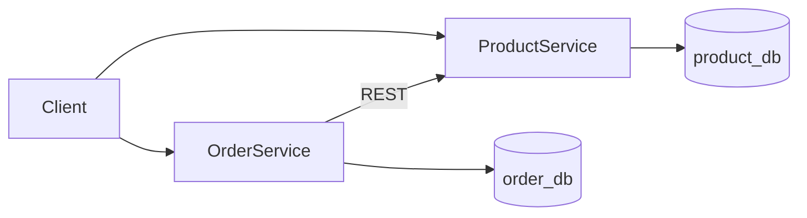

# Walmart E-Commerce Microservices Platform

A Spring Boot microservices platform modeled after a Walmart-style e-commerce backend. Each service owns its own database and communicates over REST.

## Architecture



| Service | Port | Database | Responsibility |
|---------|------|----------|----------------|
| product-service | 8081 | product_db | Product catalog CRUD, inventory |
| order-service | 8082 | order_db | Order placement, status tracking |

## Tech Stack

- Java 17
- Spring Boot 4.1
- Spring Data JPA
- PostgreSQL
- Gradle
- Lombok
- SpringDoc OpenAPI (Swagger UI)

## Prerequisites

- JDK 17+
- Docker Desktop (for PostgreSQL)
- IntelliJ IDEA (recommended)

## Quick Start

### 1. Start PostgreSQL

```bash
docker compose up -d
```

This creates `product_db` and `order_db` on `localhost:5432`.

### 2. Run product-service

```bash
cd product-service
./gradlew bootRun
```

Swagger UI: http://localhost:8081/swagger-ui.html

### 3. Run order-service

```bash
cd order-service
./gradlew bootRun
```

Swagger UI: http://localhost:8082/swagger-ui.html

## API Examples

### Create a product

```http
POST http://localhost:8081/api/products
Content-Type: application/json

{
  "name": "Walmart Laptop",
  "description": "15-inch laptop",
  "category": "Electronics",
  "price": 749.99,
  "stockQuantity": 30
}
```

### Place an order

```http
POST http://localhost:8082/api/orders
Content-Type: application/json

{
  "customerEmail": "lokesh@example.com",
  "productId": 1,
  "quantity": 2
}
```

Order-service validates stock with product-service, reduces inventory, and saves the order.

## Environment Variables

Both services support these optional overrides:

| Variable | Default |
|----------|---------|
| `DB_URL` | jdbc:postgresql://localhost:5432/{service}_db |
| `DB_USERNAME` | postgres |
| `DB_PASSWORD` | postgres |
| `PRODUCT_SERVICE_URL` | http://localhost:8081 (order-service only) |

## Project Structure

```
Walmart E-Commerce Microservices Platform/
├── docker-compose.yml
├── docker/
│   └── init-databases.sql
├── product-service/
└── order-service/
```

## Next Steps

- Add API Gateway (Spring Cloud Gateway)
- Add user-service with JWT authentication
- Add Dockerfiles for each service
- Add Kafka for async order events
